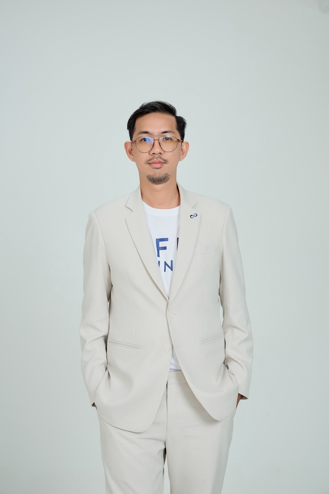

# RESUME ครีเอทีฟ

## Phuwagorn Chotchaitana
### Senior Security Consultant

---

<table style="width:100%; border: none;">
  <tr style="border: none;">
    <td style="width:30%; vertical-align: top; padding-right: 20px; border: none;">
      
        

      

        <h4 style="margin-top: 0; color: white;">LET'S GET IN TOUCH!</h4>
        
📧 t.pemapol@gmail.com

        
📞 094-7926542

        
📍 Bangkok, Thailand

        
🔗 GITHUB: [Your GitHub Profile URL](https://github.com/YourGitHubUsername)

      

       

      

        <h4 style="margin-top: 0;">RELEVANT SKILLS</h4>
        
DevOps Skill (CI/CD Tools)

        <ul>
          <li>Javascript</li>
          <li>Python</li>
          <li>Go</li>
          <li>Docker</li>
          <li>AWS</li>
          <li>Azure DevOps</li>
          <li>Kubernetes</li>
        </ul>
        
Problem-Solving

        
Team Communication

      

    </td>

    <td style="width:70%; vertical-align: top; border: none;">
      

        <h3 style="margin-top: 0;">PROFILE & JOB OBJECTIVE</h3>
        
Senior Security Consultant with 6+ years of experience in cybersecurity solutions and project implementation. Eager to leverage strong technical skills in DevSecOps, application security, and system engineering to drive security initiatives and achieve organizational goals. Passionate about learning new technologies and leading teams to successful project delivery.

      

      

        <h3 style="margin-top: 0;">WORK EXPERIENCE</h3>

        <h4>Senior Security Consultant</h4>
        **nForce Secure PCL.** (ผู้จัดจำหน่ายโซลูชันความปลอดภัยทางไซเบอร์) 
        กันยายน 2018 – กุมภาพันธ์ 2025 (6 ปี 7 เดือน)
        <ul>
          [span_0](start_span)<li>รับผิดชอบในการสนับสนุนผลิตภัณฑ์ Cybersecurity เช่น Synopsys, BigID, UCP และ FileCloud ซึ่งรวมถึงการเรียนรู้และทดสอบผลิตภัณฑ์[span_0](end_span)</li>
          [span_1](start_span)<li>ประสานงานกับ Vendor สำหรับผลิตภัณฑ์ที่เกี่ยวข้อง[span_1](end_span)</li>
          [span_2](start_span)<li>นำเสนอโซลูชันแก่ลูกค้า รวมถึงการนำเสนอ (presentations), Proof of Concept (POC), Terms of Reference (TOR), การติดตั้ง (implementation) และการสนับสนุนบริการ (service support)[span_2](end_span)</li>
          [span_3](start_span)<li>ทำงานอย่างใกล้ชิดกับชุดผลิตภัณฑ์ Synopsys ซึ่งรวมถึงเครื่องมือทดสอบความปลอดภัยของแอปพลิเคชัน (SAST, SCA, IAST, DAST) ที่ออกแบบมาเพื่อระบุช่องโหว่และรับรองการปฏิบัติตามมาตรฐานความปลอดภัย (OWASP, CWE) แพลตฟอร์ม Synopsys สามารถติดตั้งได้ทั้ง On-Premises และใน Cloud (SaaS)[span_3](end_span)</li>
          [span_4](start_span)<li>ประสบความสำเร็จในการติดตั้ง Synopsys ให้กับ PTT Digital Company โดยให้บริการออกแบบโครงสร้างพื้นฐานสำหรับทั้ง On-Premises และ Cloud (AWS, Azure DevOps), การติดตั้ง, DevSecOps workflows และการกำหนดค่า พัฒนา Pipeline Scripts โดยใช้ Jenkins และ GitLab CI เพื่อรวมเข้ากับ Synopsys พร้อมทั้งให้การสนับสนุนและฝึกอบรมทีม DevOps[span_4](end_span)</li>
          [span_5](start_span)<li>ติดตั้งโซลูชันให้กับการประปานครหลวง (MWA) และการไฟฟ้าส่วนภูมิภาค (PEA) โดยให้บริการออกแบบโครงสร้างพื้นฐาน, การติดตั้ง, การกำหนดค่า, การฝึกอบรม และการส่งมอบโครงการ[span_5](end_span)</li>
          [span_6](start_span)<li>ดำเนินการติดตั้งให้กับ True Digital Company โดยให้บริการออกแบบโครงสร้างพื้นฐานสำหรับการติดตั้ง On-Premises (Kubernetes) พร้อมกับการติดตั้ง, การกำหนดค่า, การฝึกอบรม และการส่งมอบโครงการ[span_6](end_span)</li>
          [span_7](start_span)<li>นำทีมสี่คน บริหารจัดการและให้คำปรึกษาแก่สมาชิกในทีมตลอดโครงการต่างๆ[span_7](end_span)</li>
        </ul>

        <h4>System Engineer</h4>
        **Agilis Technologies Co.Ltd.** (ผู้จัดจำหน่ายโซลูชัน Physical Security) 
        กันยายน 2015 – กันยายน 2018 (3 ปี)
        <ul>
          [span_8](start_span)<li>รับผิดชอบในการสนับสนุนผลิตภัณฑ์ระบบกล้องวงจรปิด (Video Surveillance System)[span_8](end_span)</li>
          [span_9](start_span)<li>ออกแบบโซลูชันโครงสร้างพื้นฐานสำหรับระบบกล้องวงจรปิด[span_9](end_span)</li>
          [span_10](start_span)<li>จัดการการติดตั้งและการกำหนดค่าเซิร์ฟเวอร์, สตอเรจ และ Network Switches[span_10](end_span)</li>
          [span_11](start_span)<li>ประสบความสำเร็จในการติดตั้งโครงการระยะแรกในสามจังหวัดภาคใต้ของประเทศไทย โดยติดตั้งระบบ CCTV สำหรับการรถไฟแห่งประเทศไทย (SRT) โดยมีแผนสำหรับระยะต่อไปที่จะครอบคลุมสถานีรถไฟทั้งหมดในประเทศไทย[span_11](end_span)</li>
        </ul>
      

      

        <h3 style="margin-top: 0;">EDUCATION HISTORY</h3>
        <h4>วิทยาศาสตรบัณฑิต สาขาวิทยาการคอมพิวเตอร์ (BACHELOR OF SCIENCE IN COMPUTER SCIENCE)</h4>
        สถาบัน: มหาวิทยาลัยเทคโนโลยีพระจอมเกล้าพระนครเหนือ (KING MONGKUT'S UNIVERSITY OF TECHNOLOGY NORTH BANGKOK) 
        ปีที่สำเร็จการศึกษา: 2009
      

    </td>
  </tr>
</table>

---
